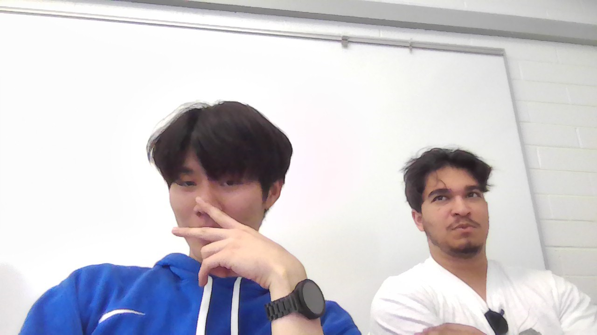

# Hi, I'm Sanggeon

## About me
I'm a student at UCSD studying **computer science**.
I love learning about cs 

> "But I'm lazy."

## Hobbies
1. Badminton
2. League
3. Basketball
   
## Skills Checklist
- [x] Markdown
- [x] React
- [x] Git & Github

## Sample Code
```
#include <stdio.h>
int main() {
    printf("Hello, GitHub Pages!\n");
    return 0;
}
```

## Picture


## Link(External, Section, Relative)
- [Github_profile](https://github.com/TopgeonKR)
- [skills](#skills-checklist)
- [PRIVATE.txt](PRIVATE.txt)
  
